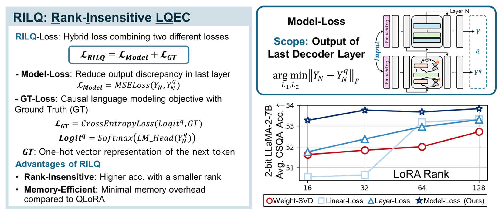

# RILQ: Rank-Insensitive LoRA-based Quantization error compensation
[](https://arxiv.org/abs/2412.01129)
[](https://aaai.org/conference/aaai/aaai-25/)
<!-- [](https://neurips.cc/virtual/2023/poster/72260) -->

This repository contains the implementation for the paper [RILQ: Rank-Insensitive LoRA-based Quantization Error Compensation for Boosting 2-bit Large Language Model Accuracy](https://arxiv.org/abs/2412.01129)




## RILQ: Memory-efficient & rank insensitive Quantization error compensation

- Fully compatible with the HuggingFace Transformers package.
- Independent of quantization methods (supports only fake quantized models).
- RILQ enhances LoRA based QEC(Quantization Error Correction).
- Rank-insensitive: achieve higher accuracy even with smaller ranks.
  


## Install & Run
Install via pip:
```
pip install -r requirements.txt
```
Run example script:
```
bash rilq-llama2_7b_r64.sh
```


## RILQ Settings

### Arg Options 
- Model
   - `base_model`: directory of FP Model
   - `q_model`: directory of Fake Quantized Model (same architecture with `base_model`)
   - `lora_r`: rank of LoRA
   - `lora_alpha`: alpha of LoRA
   - `lora_dropout`: dropout of LoRA
   - `dtype`: datatype
   - `output_dir`: directory of model optimized with RILQ
- Calibration Dataset
   - `calib_dataset`: name of calibration dataset ("c4" or "wikitext2")
   - `calib_num_samples`: number of samples
   - `calib_val_ratio`: ratio of validation dataset
   - `calib_max_length`: sequence length of each sample
- RILQ
   - `a_type`: scope of Model-Loss
     - "hid": output of the last decoder layer
     - "logit": output of lm_head, when output of the last decoder layer is not extractable (layer fusion) 
   - `approx_total_steps`: max training step
   - `approx_lr`: learning rate
   - `approx_batch_size`: batch size
   - `gradient_accumulation_steps`: gradient accumulation step
   - `approx_eval_steps`: validation step
   - `approx_early_stop`: if true, end trainig when loss converges and save model with best validation loss
   - `approx_es_patience`: the number of validation after the best validation loss to ensure convergence of loss
 

## Example Results
- The PPL results of RTN(W2A16G64) quantized LLaMA-2-7B and RILQ optimized models with different ranks
  - C4, 320 samples with 512 sequence lengths, validation ratio=0.2
  - Learning rate = 1e-4, batch size=1, gradient accumulation steps=8
  - Early stopping, evaluation steps=25, es_patience=5 

    |LoRA rank | Wiki2 | C4   | Avg. |
    |----------|-------|------|------|
    |0 (wo RILQ)| 433.65|474.32|453.99|
    |16        | 10.23 | 12.00| 11.12|
    |32        | 10.01 | 11.84| 10.93|
    |64        | 10.05 | 11.79| 10.92|
    |128       | 10.12 | 11.87| 11.00|

## Note
- Current code supports Llama-2 family and Llama-3-8B
- To support other model, modification of target linears is required
  - target_linear in `main.py`
  - MODEL_INFO in `rilq_utils/utils.py`


